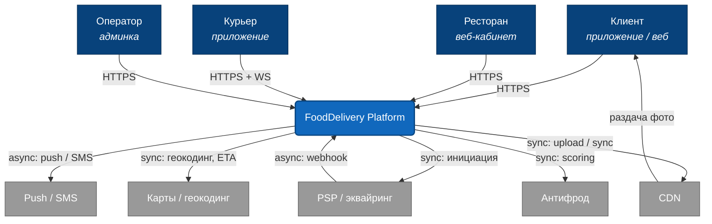
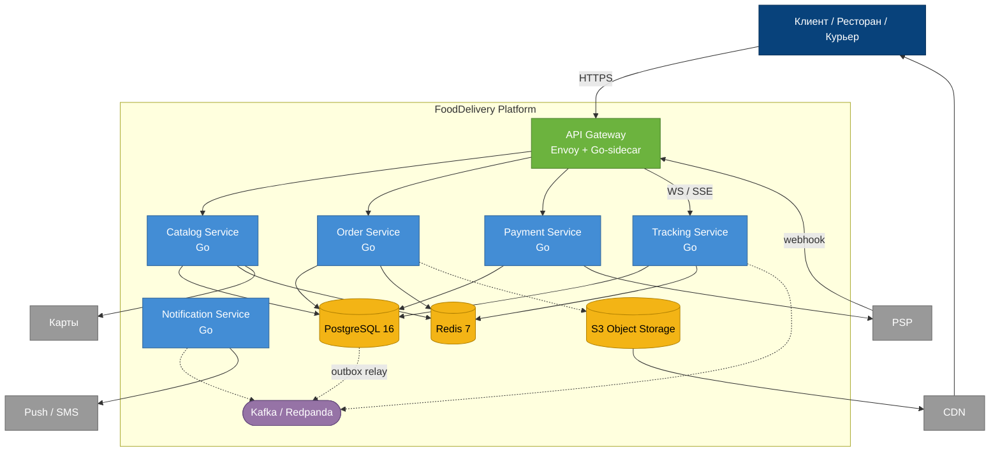
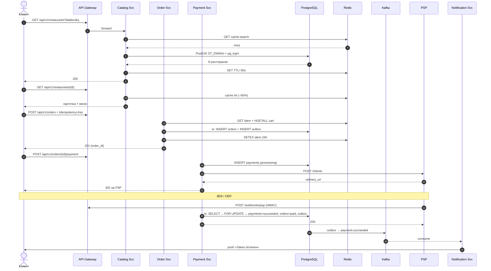
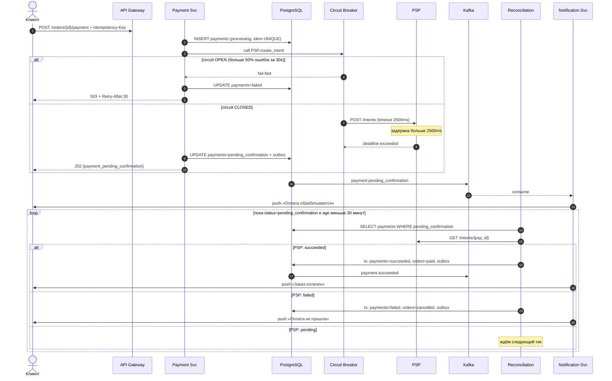
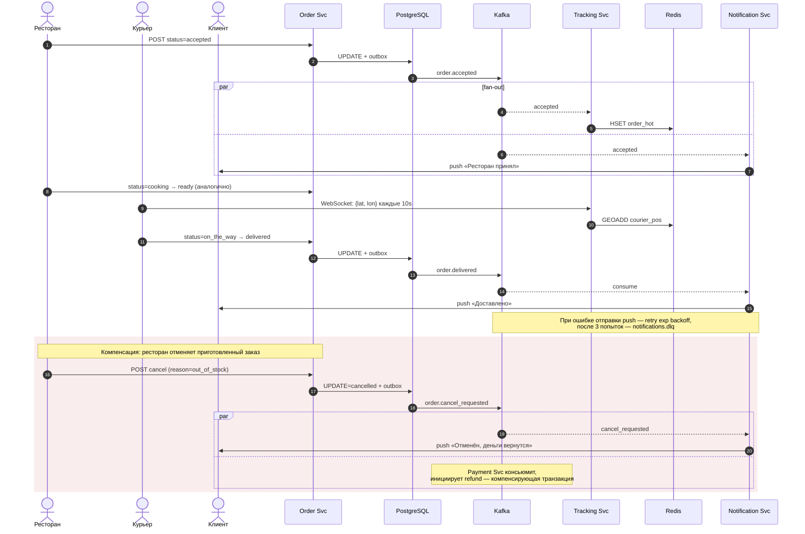

# Архитектура сервиса доставки еды

Проектирование опирается на требования из [requirements.md](requirements.md); цифры по нагрузке, SLA и объёмам данных беру оттуда.

Автор — Грузин Никита, Б13-303.

## 1. Архитектурный стиль

Выбрана Service-Based Architecture с точечным событийным слоем поверх общей Kafka. Шесть прикладных сервисов с собственными границами, общий PostgreSQL-кластер с отдельными логическими схемами под каждый сервис, Redis для ephemeral-состояния, Kafka для доменных событий.

Монолит отметается из-за разных SLA по доменам: фиксация платежа 99.99%, создание заказа 99.95%, каталог 99.90%, уведомления 99.50% — в одном процессе эти классы надёжности несовместимы. Полноценная микросервисная архитектура для команды нашего размера избыточна: service mesh, saga-оркестратор и распределённый tracing — отдельная полная ставка инженера, что не лезет в бюджет ([requirements §5.2](requirements.md#52-ограничения)), при 24 write-RPS на критичном пути ([requirements §4.3.5](requirements.md#435-итог-по-пику)) это цена без пользы. SBA даёт нужную декомпозицию без инфраструктурной перегрузки.

События применяются там, где синхронная модель ломается: жизненный цикл заказа с fan-out в уведомления и трекинг, подтверждение платежа от PSP по webhook'у, и будущий CDC в OpenSearch при миграции поиска. Остальные пути пользователя — обычный REST, клиент ждёт ответ сразу.

Полное обоснование с отклонёнными альтернативами — [ADR-001](adr/001-architecture-style.md).

## 2. Компоненты

### 2.1. C4 Level 1 — System Context

Исходник: [diagrams/c4-context.mmd](diagrams/c4-context.mmd).



Клиент, ресторан и курьер работают через свои фронты. Оператор руками разбирает спорные платежи и возвраты — нагрузки почти нет, но без этого сценария нельзя жить.

PSP — единственная причина, по которой checkout не синхронный: типовой российский провайдер работает как «инициация → redirect/3DS → webhook», см. [ADR-003](adr/003-payment-reliability.md). Push и SMS уезжают за очередь, потому что 99.5% SLA позволяет. CDN выделен отдельным каналом: если фото блюд пойдут через API, bandwidth из [requirements §4.6](requirements.md#46-bandwidth) вырастет в разы. Геокодинг и антифрод — внешние, держать свои — отдельный проект, в бюджет не влезает.

### 2.2. C4 Level 2 — Container Diagram

Исходник: [diagrams/c4-container.mmd](diagrams/c4-container.mmd). «Контейнер» здесь — в смысле C4, то есть отдельный развёртываемый процесс с состоянием, не Docker.



**API Gateway** (Envoy + Go-sidecar). Единая точка входа: TLS-терминация, JWT, rate-limit по `user_id`/`ip`, маршрутизация `/api/v1/*`, единый envelope ошибок в формате RFC 7807, проверка HMAC на webhook PSP. WebSocket-upgrade маршрутизует в Tracking sticky-сессией.

**Catalog Service** (Go, `chi` + `pgx`). Рестораны, меню, поиск. На Day 1 — `pg_trgm` + PostGIS внутри PostgreSQL; миграция на OpenSearch через CDC триггерится по метрике p99, не по календарю ([ADR-002](adr/002-data-storage.md)). Карточки кэшируются в Redis TTL 60 с с инвалидацией по событию `menu.updated`. Коммуникация — sync HTTP, sync SQL, consumer `menu.updated`.

**Order Service** (Go, `pgx`, `go-redis`). Корзина (Redis), создание заказа, смена статусов, снэпшот цен и адреса на момент checkout. Пишет `orders` и `outbox_events` одной транзакцией; события в Kafka уходят через outbox relay, не прямой produce ([ADR-003](adr/003-payment-reliability.md)).

**Payment Service** (Go, `pgx`, `sony/gobreaker`). Инициация в PSP, идемпотентный webhook, circuit breaker, reconciliation-воркер для зависших платежей. Таймаут на PSP — 2500 мс из latency-бюджета ([requirements §4.4](requirements.md#44-latency-budget-для-критичного-сценария)). Коммуникация смешанная: sync — Gateway, PSP, антифрод; async — входящий webhook, outbox publish, self-consume reconciliation.

**Tracking Service** (Go, `gorilla/websocket`). Real-time статусы и геопозиция курьера. Hot-state в Redis, в PostgreSQL — только персистентный `tracking_events` для восстановления и аудита. WebSocket / SSE с клиентом, consumer `orders.events` и `tracking.events` из Kafka.

**Notification Service** (Go, `kafka-go`, `cenkalti/backoff`). Consumer-only: слушает `orders.events` и `payments.events`, шлёт push/SMS по шаблонам через FCM/APNs/SMS-шлюз. Retry с exponential backoff, DLQ `notifications.dlq`. Async вход, sync выход.

**PostgreSQL 16** (Patroni + 1 synchronous replica, PgBouncer, PostGIS 3.4, `pg_trgm`). Source of truth для каталога, заказов, платежей, outbox, аудита. Две логические БД в одном кластере: `catalog_db` и `orders_db`. Для `orders_db` — `synchronous_commit=remote_apply` (RPO = 0 для платежей); для `catalog_db` — `local` (потеря пары секунд каталога при failover допустима). `orders` и `payments` партиционированы `BY RANGE (created_at)` по месяцам. Debezium-CDC из `outbox_events` и `menu_items` в Kafka.

**Redis 7 Cluster** (3 master + 3 replica, AOF `everysec`). Корзины `cart:{user_id}`, idempotency-ключи `idem:{key}` (TTL 24 ч, НФТ-006), кэш карточек и поиска, hot-state заказа `order_hot:{id}`, геопозиция курьеров через GEOADD, token-bucket для rate-limit.

**Kafka / Redpanda 24.x** (Kafka-wire-compatible). Шина доменных событий и канал outbox relay. Ключевые топики: `orders.events` (12 партиций, ключ = `order_id` — сохраняет порядок статусов), `payments.events` (6 партиций), `notifications.dlq`, `menu.updated`. Retention 14 дней, `acks=all`, `min.insync.replicas=2`. Redpanda вместо ванильной Kafka — один бинарник без ZooKeeper/KRaft, экономит RAM на VM PoC-фазы.

**S3 Object Storage + CDN** (Yandex S3-compatible + облачный CDN). Фото блюд и баннеры. Клиент загружает напрямую по presigned URL — бэкенд не прокачивает файлы через себя (claim-check). К концу 3-го года ≈ 6 ТБ медиа ([requirements §4.5.4](requirements.md#454-сводная-таблица)).

Отдельные Cart Service и Search Service не выделены: корзина — 4 операции над HASH в Redis, отдельный сервис на это — лишний сетевой hop. Поиск — `pg_trgm` + PostGIS умещается в p99 < 300 мс при текущих объёмах. User/Auth пока живёт в Gateway (JWT) и Order Service (адреса, история): 12 млн MAU — меньше порога, при котором отдельный сервис окупается. Saga-оркестратора тоже нет — сага по статусам сделана choreography'ей, при ~20 событий/с это избыточно.

## 3. Sequence diagrams

### 3.1. Happy path

Исходник: [diagrams/sequence-happy-path.mmd](diagrams/sequence-happy-path.mmd).



Синхронный путь клиента укладывается в бюджет 2500 мс p99 из [requirements §4.4](requirements.md#44-latency-budget-для-критичного-сценария), где доминирует шаг PSP. `Idempotency-Key` живёт в Redis 24 ч — повтор `POST /orders` возвращает тот же `order_id`. Уведомление уходит через outbox, а не изнутри webhook-транзакции: если Notification Service лежит, событие ждёт в Kafka и обработается при восстановлении.

### 3.2. Ошибка: таймаут PSP на инициации оплаты

Исходник: [diagrams/sequence-psp-timeout.mmd](diagrams/sequence-psp-timeout.mmd).



Правило: при неизвестном статусе у внешнего провайдера отдаём `202`, не гадаем succeeded/failed. Платёж получает `pending_confirmation` и ждёт окончательного решения от PSP. Reconciliation-воркер опрашивает с экспоненциальным backoff (15 с → 1 мин → 5 мин) и не дольше 30 минут. Idempotency-ключ защищает от параллельных ретраев клиента, UNIQUE на `(psp_payment_id, created_at)` — от дубликатов webhook'а.

### 3.3. Async: жизненный цикл заказа через choreography-сагу

Исходник: [diagrams/sequence-async-saga.mmd](diagrams/sequence-async-saga.mmd).



Сага — choreography: каждый переход статуса — событие в `orders.events` с ключом партиции `order_id` (чтобы порядок статусов по конкретному заказу не переставлялся). Fan-out на уведомления, трекинг и аналитику. Компенсирующая транзакция при отмене уже оплаченного заказа — refund через Payment Service по событию `order.cancel_requested`. Оркестратор не нужен: состояний немного, они линейные, всё помещается в choreography.

## 4. API

### 4.1. Версионирование и формат ошибок

URI-based versioning: `/api/v1/...`. Breaking change — параллельный `/api/v2/` не менее 3 месяцев; на устаревающей версии заголовки `Deprecation: true` и `Sunset: <RFC 9745 date>`, `Link: <new-url>; rel="successor-version"` (RFC 8288). Внутри major-версии — только additive-изменения (новые опциональные поля, новые эндпоинты); переименование или смена семантики статуса требует v2.

Все write-операции принимают заголовок `Idempotency-Key` (UUID v7, TTL 24 ч по НФТ-006). Все ошибки — в формате RFC 7807 Problem Details:

```json
{
  "type": "https://api.example.com/errors/payment-declined",
  "title": "Payment declined",
  "status": 422,
  "code": "PAYMENT_DECLINED",
  "detail": "Card issuer rejected the charge",
  "trace_id": "0ab45e2f-...",
  "instance": "/api/v1/orders/8f1d409d.../payment"
}
```

Машиночитаемая спецификация — [openapi/v1.yaml](../openapi/v1.yaml) (OAS 3.1). Ниже — 5 основных эндпоинтов, покрывающих три sequence-сценария.

### 4.2. `GET /api/v1/restaurants` — поиск

```
GET /api/v1/restaurants?lat=55.7558&lon=37.6176
    &q=pizza&cuisine=italian,american
    &max_delivery_fee=300&sort=delivery_time
    &page=1&per_page=20
```

Response 200:
```json
{
  "total": 124, "page": 1, "per_page": 20,
  "items": [{
    "restaurant_id": "018ef5c8-...",
    "name": "Pizza Town",
    "cuisine": ["italian", "american"],
    "rating": 4.7, "eta_minutes": 28,
    "delivery_fee": 199, "min_order_amount": 500,
    "distance_meters": 1320, "is_open": true,
    "preview_photo_url": "https://cdn.example.com/.../cover.jpg"
  }]
}
```

Ошибки: `400 VALIDATION_ERROR` (невалидные координаты, `per_page > 50`), `401 UNAUTHENTICATED`, `429 RATE_LIMITED` (более 20 req/s на пользователя), `503 CATALOG_UNAVAILABLE`.

### 4.3. `GET /api/v1/restaurants/{id}` — карточка с меню

Высокочастотный read; кэшируется в Redis `cache:menu:{id}` TTL 60 с, инвалидация по `menu.updated`. Пиковый RPS до 433 ([requirements §4.3.3](requirements.md#433-пиковый-rps-по-операциям)).

Response 200 — объект с полями `restaurant_id, name, cuisine, rating, hours, address{city, street_line, lat, lon}, min_order_amount, delivery_fee, eta_minutes, menu[]`. Элемент меню: `menu_item_id, name, description, price, category, is_available, image_url, options[]`.

Ошибки: `404 RESTAURANT_NOT_FOUND`, `410 RESTAURANT_CLOSED` (архивирован — не путать с «закрыт по часам работы», который отдаётся полем `is_open`).

### 4.4. `POST /api/v1/orders` — создание заказа

Идемпотентно по `Idempotency-Key`. Снэпшот позиций и цен фиксируется в `items_snapshot`: последующие правки меню не ломают уже созданный заказ (ФТ-004).

Request:
```json
{
  "restaurant_id": "018ef5c8-...",
  "items": [
    {"menu_item_id": "018ef5c8-...", "quantity": 2, "options": ["extra_cheese"]}
  ],
  "delivery_address": {
    "city": "Москва", "street_line": "Тверская, 1, кв. 5",
    "lat": 55.7558, "lon": 37.6176
  },
  "comment": "Позвонить за 5 минут",
  "promo_code": "LUNCH15"
}
```

Response 201:
```json
{
  "order_id": "018ef5c8-...",
  "status": "awaiting_payment",
  "total_amount": 1470, "currency": "RUB",
  "delivery_fee": 199,
  "items_snapshot_hash": "sha256:...",
  "estimated_delivery_at": "2026-04-24T19:30:00Z",
  "created_at": "2026-04-24T19:00:00Z"
}
```

Повтор с тем же ключом и телом возвращает `200` вместо `201` — клиент так отличает «создан сейчас» от «уже существовал».

Ошибки: `400 VALIDATION_ERROR`, `404 RESTAURANT_NOT_FOUND`/`MENU_ITEM_NOT_FOUND`, `409 IDEMPOTENCY_CONFLICT` (тот же ключ + другое тело), `422 ITEM_UNAVAILABLE`/`RESTAURANT_CLOSED`/`PROMO_INVALID`, `429 RATE_LIMITED` (более 5 заказов/мин), `503 ORDER_SERVICE_UNAVAILABLE`.

### 4.5. `POST /api/v1/orders/{id}/payment` — инициация оплаты

Request:
```json
{"payment_method": "card", "return_url": "https://app.example.com/orders/.../status"}
```

Response 200 (инициация прошла):
```json
{
  "payment_id": "018ef5c8-...", "order_id": "018ef5c8-...",
  "status": "processing",
  "redirect_url": "https://psp.example.com/pay/intent_abc",
  "amount": 1470, "currency": "RUB",
  "expires_at": "2026-04-24T19:15:00Z"
}
```

Response 202 (PSP не ответил, см. [§3.2](#32-ошибка-таймаут-psp-на-инициации-оплаты)):
```json
{
  "payment_id": "018ef5c8-...", "order_id": "018ef5c8-...",
  "status": "payment_pending_confirmation",
  "message": "Уточняем статус у провайдера"
}
```

Ошибки: `400 INVALID_PAYMENT_METHOD`, `404 ORDER_NOT_FOUND`, `409 INVALID_ORDER_STATE` (не в `awaiting_payment`), `422 ANTIFRAUD_REJECTED`, `503 PAYMENT_PROVIDER_UNAVAILABLE` (circuit breaker OPEN) с заголовком `Retry-After: 30`.

### 4.6. `GET /api/v1/orders/{id}` — состояние заказа

Читается из Redis `order_hot:{id}`, fallback на PostgreSQL. Пиковый RPS до 971 на живых заказах ([requirements §4.3.4](requirements.md#434-нагрузка-от-live-tracking)); для real-time клиенты поднимают WebSocket `/api/v1/tracking` или SSE `/api/v1/orders/{id}/stream`. REST — fallback, когда WebSocket недоступен (≈ 20% трафика).

Response 200:
```json
{
  "order_id": "018ef5c8-...",
  "status": "courier_on_the_way",
  "estimated_delivery_at": "2026-04-24T19:30:00Z",
  "courier": {"lat": 55.7588, "lon": 37.6190, "updated_at": "..."},
  "timeline": [
    {"status": "created", "at": "..."},
    {"status": "paid", "at": "..."},
    {"status": "accepted", "at": "..."},
    {"status": "cooking", "at": "..."},
    {"status": "ready", "at": "..."},
    {"status": "courier_on_the_way", "at": "..."}
  ]
}
```

Ошибки: `401 UNAUTHENTICATED`, `403 FORBIDDEN` (чужой заказ), `404 ORDER_NOT_FOUND`.

## 5. Выбор БД и модель данных

Обоснование polyglot-стратегии и отклонённых альтернатив — [ADR-002](adr/002-data-storage.md).

### 5.1. Сводка по хранилищам

| Хранилище | Что и зачем |
|---|---|
| **PostgreSQL 16** (`orders_db`) | Заказы, платежи, outbox, tracking-persist. ACID на multi-table транзакцию `orders + outbox` — без этого нельзя гарантировать «платежи не теряем». Партиционирование `BY RANGE (created_at)` по месяцам держит активную партицию в районе 35 ГБ и индексы тёплыми. |
| **PostgreSQL 16** (`catalog_db`) | Рестораны и меню. Read-heavy, редкие UPDATE. PostGIS + `pg_trgm` покрывают геопоиск и FTS без отдельного движка; миграция на OpenSearch — когда p99 каталога перейдёт 300 мс. |
| **Redis 7 Cluster** | Корзины, idempotency-ключи, hot-cache карточек, hot-state заказа, GEO курьеров, token-bucket rate-limit. Всё эфемерное, с TTL. В PostgreSQL это лишние IOPS. |
| **Kafka / Redpanda 24.x** | Append-only лог событий, fan-out потребителям, retention 14 дней. Реплей нужен для outbox relay и DLQ. |
| **S3 + CDN** | Фото блюд, баннеры. Прямой upload по presigned URL снимает bandwidth с API. |

### 5.2. Модель данных

UUID везде — v7 (timestamp-prefixed): нативно упорядочен по времени создания, B-tree индексы на PK не фрагментируются при вставке (проблема UUID v4 в больших таблицах). Поддержка в PostgreSQL 16 через `pg_uuidv7`.

#### `catalog_db.restaurants`

| Поле | Тип | |
|---|---|---|
| id | UUID v7 | PK |
| name | VARCHAR(255) | NOT NULL |
| cuisine | TEXT[] | NOT NULL |
| rating | NUMERIC(2,1) | CHECK 0..5 |
| eta_minutes | SMALLINT | |
| delivery_fee | INTEGER | копейки |
| min_order_amount | INTEGER | |
| is_active | BOOLEAN | default true |
| hours | JSONB | |
| location | `geography(Point, 4326)` | NOT NULL |
| search_doc | TSVECTOR | generated from name + cuisine |
| created_at / updated_at | TIMESTAMPTZ | |

Индексы: `PRIMARY KEY (id)`, `GIN (cuisine)`, `GIST (location)` для `ST_DWithin`, `GIN (search_doc)` для FTS, partial `BTREE (is_active) WHERE is_active = true`.

Объём: ~60 000 стартово, ~90 000 через 3 года ([requirements §4.5.1](requirements.md#451-пользователи-адреса-рестораны-и-меню-metadata)), с индексами ≈ 0.5 ГБ — целиком в RAM.

#### `catalog_db.menu_items`

| Поле | Тип | |
|---|---|---|
| id | UUID v7 | PK |
| restaurant_id | UUID v7 | FK → restaurants.id ON DELETE CASCADE |
| name, description | VARCHAR / TEXT | |
| price | INTEGER | копейки, CHECK ≥ 0 |
| category | VARCHAR(100) | |
| is_available | BOOLEAN | |
| image_url | TEXT | |
| options | JSONB | |

Индексы: `PRIMARY KEY (id)`, partial `BTREE (restaurant_id, is_available) WHERE is_available = true` (основной паттерн «меню ресторана для витрины»), `GIN (name gin_trgm_ops)` для автодополнения.

Объём: 60 000 × 80 ≈ 4.8 млн строк, ~10 ГБ.

#### `orders_db.orders` — partitioned by RANGE (created_at) monthly

| Поле | Тип | |
|---|---|---|
| id | UUID v7 | PK (входит в partition key) |
| user_id | UUID v7 | |
| restaurant_id | UUID v7 | логическая связь cross-schema |
| status | VARCHAR(32) | CHECK enum |
| items_snapshot | JSONB | копия позиций/цен на момент checkout |
| total_amount, delivery_fee | INTEGER | копейки |
| delivery_address | JSONB | |
| idempotency_key | UUID v7 | UNIQUE в партиции |
| created_at | TIMESTAMPTZ | partition key |
| updated_at | TIMESTAMPTZ | |

Индексы: `PRIMARY KEY (id, created_at)`, `UNIQUE (idempotency_key, created_at)`, `BTREE (user_id, created_at DESC)` для личного кабинета, `BTREE (restaurant_id, created_at DESC)` для кабинета ресторана, partial `BTREE (status) WHERE status IN ('awaiting_payment','paid','accepted','cooking','ready','courier_on_the_way')` — только активные, индекс остаётся маленьким. На старых партициях — `BRIN (created_at)` для аналитики.

Объём: 436 800 заказов/сутки × 365 ≈ 160 млн/год ([requirements §4.5.2](requirements.md#452-заказы-и-платежи)), ~2.5 КБ/строка → ~400 ГБ raw/год, ~900 ГБ с индексами и репликой.

#### `orders_db.payments` — partitioned monthly

| Поле | Тип | |
|---|---|---|
| id | UUID v7 | PK |
| order_id | UUID v7 | |
| status | VARCHAR(32) | processing / succeeded / failed / pending_confirmation / refunded |
| amount | INTEGER | |
| payment_method, psp_name | VARCHAR | |
| psp_payment_id | VARCHAR(255) | UNIQUE в партиции |
| idempotency_key | UUID v7 | UNIQUE |
| failure_reason | TEXT | |
| attempt_no | SMALLINT | default 1 |
| created_at | TIMESTAMPTZ | partition key |
| confirmed_at | TIMESTAMPTZ | |

Индексы: `PRIMARY KEY (id, created_at)`, `UNIQUE (psp_payment_id, created_at)` — дедупликация webhook'ов, ключевой инвариант ([ADR-003](adr/003-payment-reliability.md)); `UNIQUE (idempotency_key, created_at)`; `BTREE (order_id, created_at DESC)`; partial `BTREE (status, created_at) WHERE status IN ('processing','pending_confirmation')` — малый и горячий, селектор для reconciliation.

Объём: ~160 млн/год (с учётом повторных попыток).

#### `orders_db.outbox_events`

| Поле | Тип | |
|---|---|---|
| id | BIGSERIAL | PK |
| aggregate_type, aggregate_id | VARCHAR / UUID | order / payment |
| event_type | VARCHAR(64) | `order.created`, `payment.succeeded`, … |
| payload | JSONB | |
| created_at, published_at | TIMESTAMPTZ | |

Индексы: `PRIMARY KEY (id)`, partial `BTREE (published_at NULLS FIRST, id) WHERE published_at IS NULL` — relay читает только неотправленные, индекс остаётся в десятках тысяч строк. Опубликованные строки живут 7 дней для аудита, потом уезжают в `outbox_archive`.

### 5.3. Ephemeral-данные в Redis

`cart:{user_id}` — HASH `{menu_item_id:options_hash → {qty, price_at_add}}`, TTL 24 ч. `idem:{key}` — JSON первого успешного ответа, TTL 24 ч. `cache:menu:{id}` — STRING, TTL 60 с, инвалидация по `menu.updated`. `cache:search:{hash}` — STRING, TTL 30 с. `order_hot:{id}` — HASH со статусом и таймлайном, TTL 1 ч, обновляется Tracking Service по `order.*`. `courier_pos` — GEO-set, `GEOADD` каждые ~10 с, параллельный ZSET по timestamp для GC устаревших позиций. `rate:{subject}:{window}` — token-bucket.

## 6. ADR

| ADR | Тема | Коротко |
|---|---|---|
| [001](adr/001-architecture-style.md) | Архитектурный стиль | SBA + точечный EDA вместо монолита и мелкозернистой MSA. |
| [002](adr/002-data-storage.md) | Стратегия хранения | PostgreSQL + Redis + Kafka + S3; OpenSearch — Day 2 по метрике p99. |
| [003](adr/003-payment-reliability.md) | Надёжность платежей | Transactional outbox + `Idempotency-Key` + идемпотентный webhook + reconciliation. |
